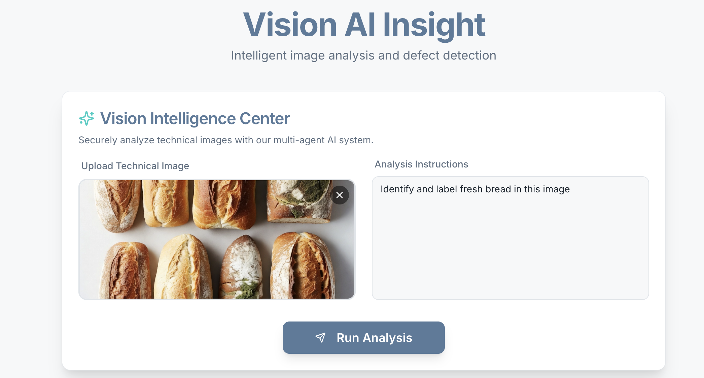
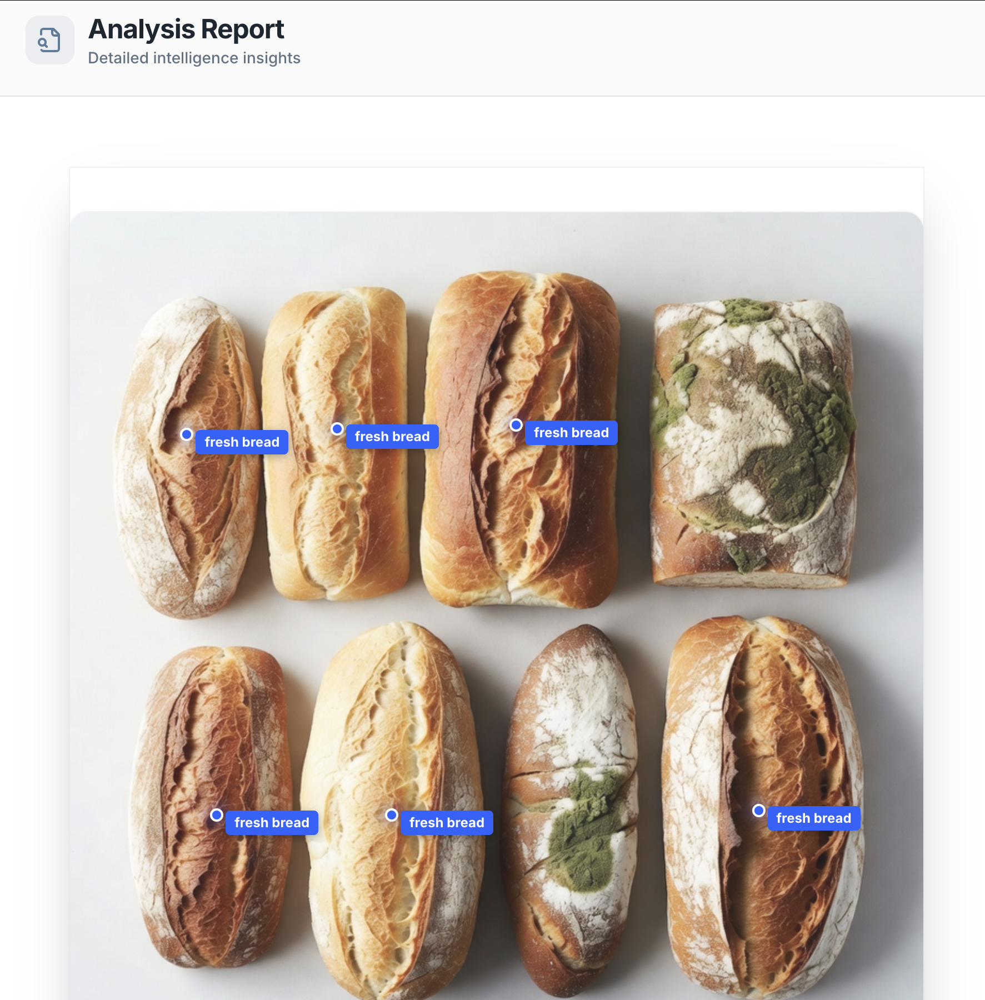

# Vision AI Insight

Vision AI Insight is a high-security, intelligent image analysis platform built with Next.js and powered by Google Genkit. It features a multi-agent AI architecture designed to provide deep technical insights while maintaining the highest standards of safety and security.

## 🚀 Key Features

- **Multi-Agent AI Workflow**: Implements a dedicated AI Safety Agent that pre-screens all requests before they reach the analysis engine.
- **Intelligent Technical Analysis**: Analyzes images for defects, structural issues, or specific user-defined technical criteria.
- **Visual Image Labeling**: Automatically detects and labels objects directly on the technical image using a CSS-based overlay system.
- **Robust Safety Guardrails**: Hardened against adversarial attacks, including prompt injection and jailbreaking.
- **Rich HTML Reporting**: Generates detailed, well-formatted analysis reports directly in the browser with interactive-style visualizations.

## 🎬 Demo

### 1. Analysis Request
Upload a technical image and provide specific instructions for the AI to follow.


### 2. Analysis Report
The AI generates a comprehensive report with visual markers and labels placed directly on the original image.


## 🛡️ AI Safety Agent (Core)

The application features a mandatory **AI Safety Pre-check** flow. No data is sent to the analysis backend unless it passes these rigorous checks:

- **Anti-Discrimination**: Blocks racist language, racial slurs, and requests promoting racial bias.
- **Content Filtering**: Strictly prohibits pornography, explicit material, and Child Sexual Abuse Material (CSAM).
- **Adversarial Protection**: Detects and prevents prompt injection and jailbreaking attempts.
- **System Integrity**: Validates that user instructions align with safe and ethical AI usage.

## 🛠️ Tech Stack

- **Framework**: [Next.js 15+](https://nextjs.org/) (App Router)
- **AI Orchestration**: [Google Genkit](https://github.com/firebase/genkit)
- **UI Components**: [Shadcn UI](https://ui.shadcn.com/) & [Tailwind CSS](https://tailwindcss.com/)
- **Icons**: [Lucide React](https://lucide.dev/)
- **LLM Model**: Gemini 2.0 Flash

## 🚦 Getting Started

### Prerequisites

- Node.js installed
- A Gemini API Key (configured in `.env`)
- A local backend service running at `http://localhost:8000/robot-helper` (for the main analysis)

### Installation

1. Clone the repository.
2. Install dependencies:
   ```bash
   npm install
   ```
3. Set up your environment variables in `.env`:
   ```env
   GOOGLE_GENAI_API_KEY=your_api_key_here
   ```
4. Start the development server:
   ```bash
   npm run dev
   ```

## 🏗️ Architecture

1. **User Input**: User uploads a technical image and provides analysis instructions.
2. **Safety Agent (Local)**: A Genkit flow (`aiSafetyPreCheck`) analyzes both the prompt and the image for safety violations.
3. **External Analysis**: If safe, the frontend sends the request to the local analysis backend.
4. **Data Extraction**: The system extracts base64 images and detection coordinates from the backend's HTML/JSON response.
5. **Rendering**: The resulting HTML report is sanitized and rendered with a CSS-based labeling overlay.

---

Built with ❤️ in Firebase Studio.
